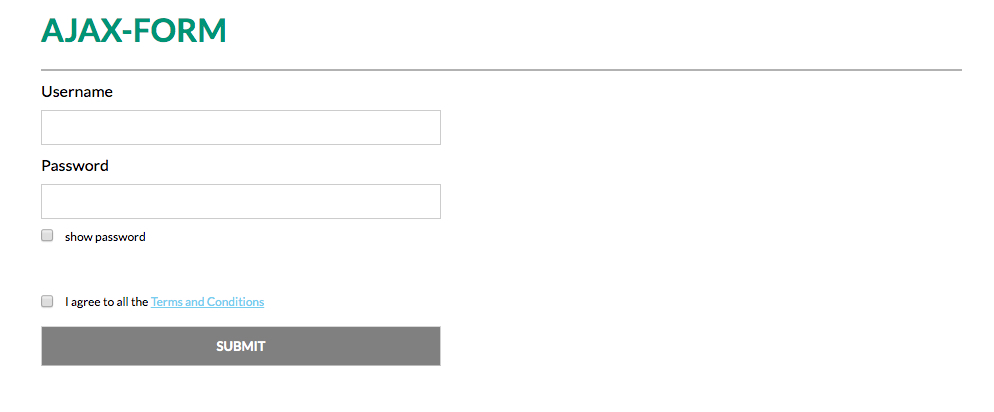
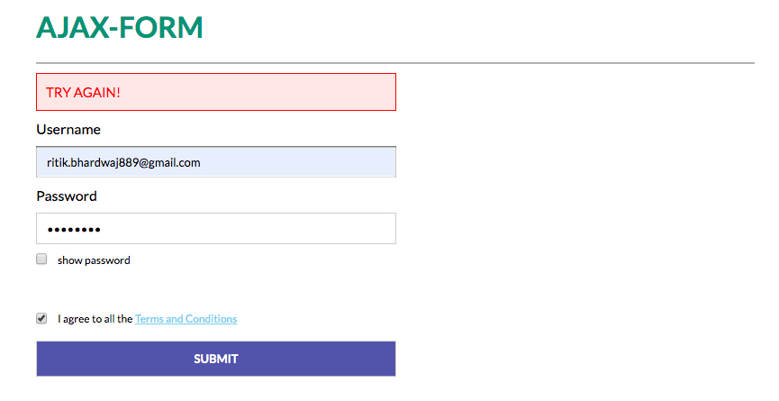
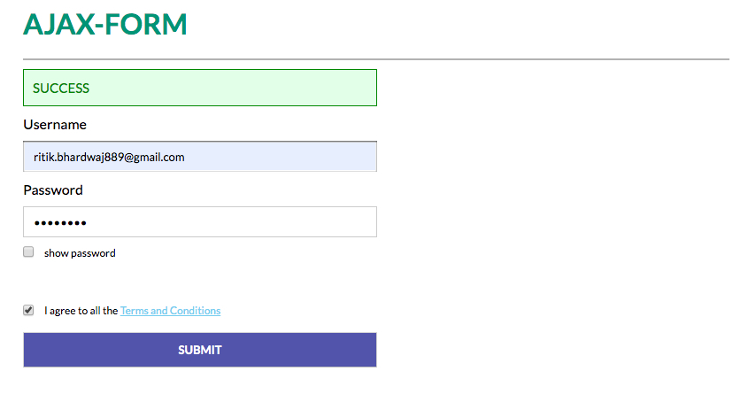

# Simple AJAX form



## HTML

```html
<!-- Container to display the form messages like success or try again. -->
<div id="form-message"></div>

<!-- Container to hold the form contents -->
<div id="form">
  <label for="username">Username</label>
  <input id="username" name="username" type="text" spellcheck="false" />
  <label for="password">Password</label>
  <input id="password" name="password" type="password" spellcheck="false" />

  <!-- Show password checkbox -->
  <div id="show_password">
    <input id="checkbox" type="checkbox" />
    <p>show password</p>
  </div>

  <!-- I agree checkbox  -->
  <div id="agree">
    <input id="checkbox" type="checkbox" />
    <p>I agree to all the <span id="terms">Terms and Conditions</span></p>
  </div>
</div>

<!-- Button to submit the form -->
<button id="btn-submit" disabled>Submit</button>
```

## Javascript ([JQuery](https://jquery.com))

```javascript
//DOM loaded
$(document).ready(() => {
  // 'I agree' button logic
  const agree = $("div#agree input");
  agree.click(() => {
    if ($(agree).prop("checked") === true) {
      $("button#btn-submit").prop("disabled", false);
      $("button#btn-submit").addClass("enabled");
    } else {
      $("button#btn-submit").prop("disabled", true);
      $("button#btn-submit").removeClass("enabled");
    }
  });

  // 'Show password' button logic
  const show_passwd = $("div#show_password input");
  show_passwd.click(() => {
    if ($(show_passwd).prop("checked") === true) {
      $("div#form input#password").attr("type", "text");
    } else if ($(show_passwd).prop("checked") === false) {
      $("div#form input#password").attr("type", "password");
    }
  });

  // Submit button logic
  $("#btn-submit").click(() => {
    var user = $("input#username").val();
    var pass = $("input#password").val();
    var data = {
      username: user,
      password: pass
    };

    //Reference to the form message container
    const form_message = $("div#form-message");
    //JQuery AJAX
    $.ajax({
      url: "ENTER YOUR URL",
      headers: {
        "Content-Type": "application/json;charset=UTF-8"
      },
      data: JSON.stringify(data),
      method: "POST"
    })
      // If the request is successful
      .done(response => {
        if (response.authorized) {
          form_message.css("display", "block");
          form_message.html("<p>Success</p>");
          form_message.addClass("success");
          form_message.removeClass("faliure");
        } else {
          form_message.css("display", "block");
          form_message.html("<p>Try again!</p>");
          form_message.removeClass("success");
          form_message.addClass("faliure");
        }
      })
      //If the request fails
      .fail(error => {
        form_message.css("display", "block");
        form_message.html("<p>Server error!</p>");
        form_message.removeClass("success");
        form_message.addClass("faliure");
      });
  });
});
```

## Add your own server address

```javascript
const configuration = {
  url: "URL" //Add your own server address here
};
$.ajax(configuration)
  .done()
  .fail();
```

# Form in action

### [1] Wrong credentials



### [2] Success


